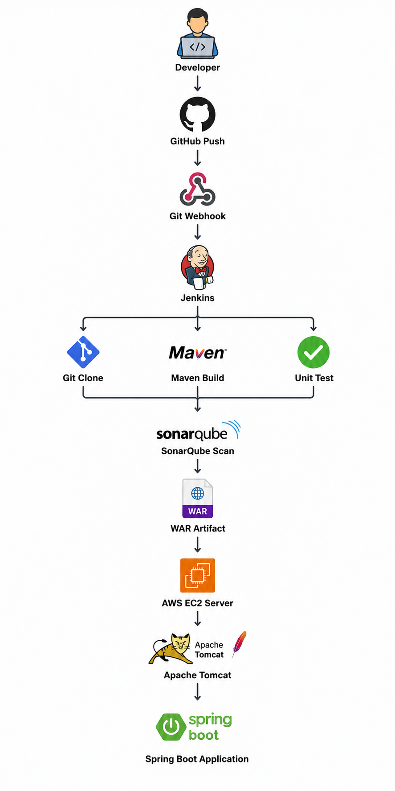

## Architecture

<p align="center">

</p>

## Workflow

1. Developer pushes code to GitHub.
2. GitHub Webhook triggers Jenkins.
3. Jenkins performs:
   - Git Clone
   - Maven Build
   - Unit Testing
4. SonarQube performs code quality analysis.
5. WAR artifact is generated.
6. Artifact is deployed to AWS EC2.
7. Apache Tomcat hosts the application.
8. Spring Boot application becomes live.

### Technologies

- GitHub
- Jenkins
- Maven
- SonarQube
- Apache Tomcat
- AWS EC2
- Spring Boot

---

## Repository Structure

```
.
├── terraform/
├── ansible/
├── docker/
├── jenkins/
├── app/
├── images/
└── README.md
```